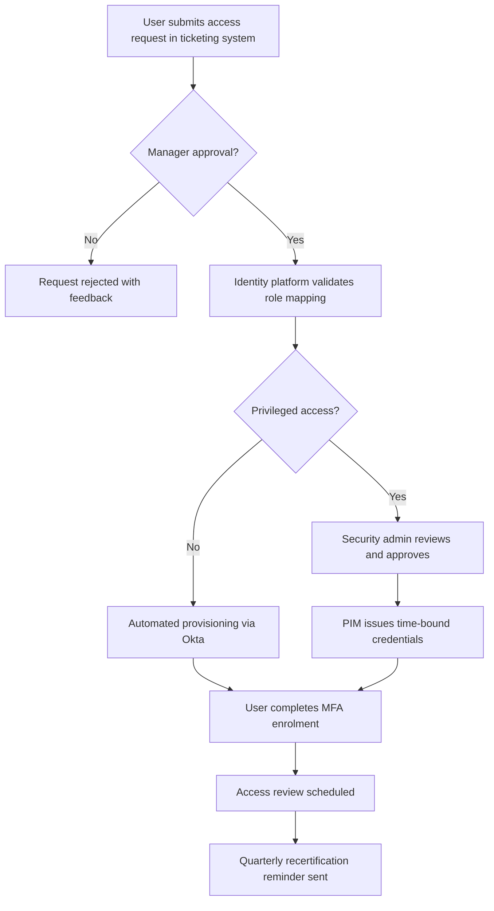

# Access Control Policy

**Company:** Cyber Ask Ltd (CYBER ASK LTD), Registered No. 15113248  
**Author:** Wayne Evans (Director)

This policy establishes comprehensive requirements for granting, reviewing, and revoking access to information systems so that only authorized individuals perform approved activities. It aligns with ISO/IEC 27001 and other regulatory frameworks, providing a control environment that protects confidentiality, integrity, and availability of organizational assets.

## Cyber Ask Operating Context

1. Cyber Ask Ltd operates with a single employee who also serves as the sole director responsible for governance, risk, and compliance decisions.
2. Cyber Ask Ltd maintains professional liability insurance covering its consulting and advisory services.
3. A dedicated virtual machine functions as the single Windows Server domain controller and is synchronized with Microsoft Entra ID for identity management.
4. The organisation holds a standard Microsoft 365 licence; Microsoft Purview and Microsoft Defender add-ons are not deployed, and Windows Defender provides endpoint protection.
5. Customer data is stored on BitLocker-encrypted drives to protect information at rest.
6. Cyber Ask Ltd assets are vulnerability-assessed weekly and patched promptly according to remediation guidance.
7. Cyber Ask Ltd has not yet achieved Cyber Essentials, Cyber Essentials Plus, or ISO 27001 certification but aligns its controls with those standards where practicable.
8. The Director personally fulfils HR, IT administration, and compliance duties, engaging specialist suppliers when additional expertise is required.

## Purpose

The purpose of this policy is to define a consistent and auditable process for managing access to company resources. It ensures that access rights are granted based on legitimate business needs, remain commensurate with job responsibilities, and are removed promptly when no longer required. The policy also seeks to minimize security risks posed by excessive or outdated privileges.

## Scope

This policy applies to all employees, contractors, consultants, partners, and temporary staff who use or manage company information systems. It covers every system, application, database, network device, and cloud service that stores, processes, or transmits organizational information, regardless of location or hosting arrangement. Third-party service providers must adhere to equivalent access controls as a condition of their engagement.

## Definitions

1. **Access Rights:** The specific permissions granted to a user to read, modify, execute, or delete information or resources.
2. **Least Privilege:** The principle that users should be granted only the minimum access necessary to perform their duties.
3. **Multi-factor Authentication (MFA):** A security mechanism requiring two or more verification methods to authenticate a user.
4. **Privileged Account:** An account with elevated permissions that can modify system configurations or access restricted data.

## Policy Statements

1. **Account Provisioning**
   1. Managers must submit documented access requests through the approved ticketing system.
   2. IT will create accounts with unique user IDs and verify managerial approval prior to granting access.
   3. Temporary accounts shall include an expiration date not exceeding 30 days unless renewed.

2. **Access Modification**
   1. Any change to a user’s role or responsibilities requires a reassessment of existing access rights.
   2. Managers and system owners must validate requests for additional permissions and ensure they align with business needs.

3. **Access Reviews**
   1. Managers must conduct access reviews at least quarterly to confirm continued necessity of privileges.
   2. Results of access reviews shall be documented and retained for a minimum of three years.
   3. Internal audit may perform independent spot checks of user access to verify compliance.

4. **Access Revocation**
   1. HR will notify IT of employee departures or role changes immediately upon confirmation.
   2. IT shall disable associated accounts within one business day of notification.
   3. Physical access devices (badges, keys, tokens) must be returned or deactivated on termination.

5. **Privileged Access Management**
   1. Administrative accounts must use MFA and are restricted to authorized personnel with demonstrated need.
   2. Privileged sessions shall be logged and monitored for anomalous activity.
   3. Shared privileged accounts are prohibited unless technically unavoidable, in which case compensating controls such as password vaulting must be implemented.

6. **Password Management**
   1. Passwords must meet complexity requirements defined by the company’s password standard and be changed at least every 90 days.
   2. Reuse of the previous 12 passwords is prohibited.
   3. Default passwords on new systems must be changed before deployment and never used in production environments.

7. **Separation of Duties**
   1. No single individual should be able to develop, approve, and deploy changes to production systems without oversight.
   2. Access granting functions must be segregated from approval functions to prevent abuse.

8. **Third-Party Access**
   1. External vendors or partners requiring system access must sign appropriate agreements and comply with this policy.
   2. Accounts for third parties shall be time-bound and reviewed before renewal.

## Roles and Responsibilities

1. **IT Department:** Implements technical controls, maintains audit logs, and enforces provisioning and revocation procedures. IT is responsible for monitoring privileged activities and reporting suspected violations.
2. **Managers and System Owners:** Initiate access requests, perform periodic access reviews, and ensure that staff receive appropriate security training.
3. **Human Resources:** Communicates staffing changes that affect access and coordinates offboarding activities.
4. **Internal Audit:** Performs independent assessments of access control effectiveness and reports findings to management.
5. **Users:** Maintain the confidentiality of their credentials, follow approved procedures, and report suspected account misuse.

## Accountable Roles and Decision Authority

1. **Director:** Owns and maintains this policy, coordinates updates, and ensures alignment with the Cyber Governance Policy and Document Control Policy.
2. **Director (Risk Owner):** Reviews and approves exceptions, risk acceptances, and material control changes, documenting rationale in line with the Risk Management Policy.
3. **Director (Service Owner):** Oversees day-to-day execution of this policy, vendor engagement, and customer communications when actions affect external parties.

## Monitoring and Enforcement

1. All access to critical systems must be logged and retained according to the company’s data retention schedule.
2. Security operations will review logs for suspicious activity and escalate incidents per the incident response plan.
3. Violations of this policy may result in disciplinary action up to and including termination, civil liability, or criminal prosecution.

## Training and Awareness

1. All users must complete annual security awareness training that covers secure authentication practices, proper handling of credentials, and reporting procedures for suspected access violations.
2. IT shall provide targeted training for administrators on privileged account management tools and procedures.

## Access Control Technologies

1. Systems handling sensitive information must implement industry-standard authentication mechanisms such as LDAP, SAML, or OAuth2.
2. Wherever feasible, single sign-on (SSO) shall be used to centralize authentication and streamline account management.
3. Encryption must protect authentication data in transit and at rest, and default system credentials shall be changed prior to production use.

## Exceptions

1. Exceptions to this policy require a documented risk assessment and written approval from the Chief Director (CISO) or delegate. Approved exceptions must include compensating controls and an expiration date.

## Compliance and Review

This policy is reviewed at least annually or upon significant system changes to ensure ongoing effectiveness and alignment with legal, regulatory, and contractual requirements. Compliance with this policy supports relevant ISO/IEC 27001 controls, including A.9 Access Control, and may be audited at management’s discretion.

## Revision History

| Version | Date       | Description             | Author |
| ------- | ---------- | ----------------------- | ------ |
| 1.0     | 2023-01-01 | Initial policy release  | IT     |
| 2.0     | 2025-09-10 | Comprehensive expansion | IT     |
| 3.0     | 2025-09-10 | Implementation guidelines added | Policy Team |
| 3.1     | 2025-10-05 | Author attribution updated | Wayne Evans (Director) |

## Implementation Guidelines
1. The Director records policy-related approvals and evidence in the central document repository and retains them for audit purposes.
2. BitLocker-encrypted storage protects customer data on company systems, and Windows Defender telemetry is reviewed weekly.
3. Weekly vulnerability scans and monthly patch reviews are led by the Director, with remediation actions tracked to completion.
4. Microsoft 365 security settings rely on features provided within the standard licence; compensating controls are documented when advanced tooling is unavailable.
5. Exceptions require written approval from the Director, including compensating controls and a defined review date.

## Role-Based Access Control Standards

Role-based access control (RBAC) is the authoritative method for assigning privileges across the organisation. Roles are mapped to business functions, and each access change must demonstrate compliance with the principle of least privilege. The following matrix defines the approved enterprise roles, the standard permission sets, and the justification for each access level in alignment with NIST AC-2 (Account Management) and AC-3 (Access Enforcement):

| Role | Permissions | Justification |
| --- | --- | --- |
| Director / Executive Owner | Global administrator rights in Microsoft Entra ID, access to financial systems, contractual repositories, and incident response tooling. | Required to discharge governance obligations, approve risk treatments, and coordinate emergency response actions across all systems. |
| Security Administrator | Privileged access to identity governance, SIEM configurations, endpoint detection consoles, and network policy enforcement platforms. | Ensures technical enforcement of access controls, continuous monitoring, and rapid containment of threats. |
| Systems Engineer | Deployment, configuration, and maintenance rights on server infrastructure, cloud workloads, and automation pipelines with no access to financial records. | Supports operational continuity and patching activities while maintaining separation of duties. |
| Business Analyst | Read-only access to client deliverables, analytics dashboards, and collaboration spaces with data export controls. | Enables client reporting without exposing administrative functions or sensitive configuration data. |
| Contractor / Third Party | Time-bound access to designated project workspaces, ticketing queues, and required APIs via just-in-time provisioning. | Provides the minimum permissions necessary to fulfil contracted deliverables and supports contractual auditability. |
| Guest / Client Collaborator | Scoped access to shared Microsoft 365 folders and secure messaging channels with watermarking and download restrictions. | Facilitates client collaboration while preventing exfiltration of unapproved data. |

Role definitions are reviewed quarterly by the Director and security administrator to verify they still represent business functions accurately. When new services are introduced, a role design workshop must precede production onboarding to ensure the new access profile inherits the least privilege posture.

## Provisioning and Deprovisioning Procedures

Access provisioning, modification, and revocation are orchestrated through automated workflows anchored in the company identity platform (Okta or Microsoft Entra ID). The Director maintains the authoritative roster of personnel and contractors, and the following procedural controls are enforced:

1. **Intake and Verification**
   - Managers or engagement leads raise a service request in the ticketing system, attaching signed statements of work or employment agreements. Requests are validated against HR records and vendor onboarding checklists.
   - Tickets lacking documented business justification, data handling requirements, or retention periods are automatically rejected by workflow rules.

2. **Automated Provisioning**
   - Once approved, Okta Lifecycle Management triggers just-in-time account creation in downstream applications using SCIM or API integrations. Default access bundles are applied based on RBAC mappings, and MFA enrolment is required before first login.
   - Access requiring privileged roles triggers a secondary approval by the security administrator, and session recordings are enabled automatically for systems supporting Privileged Access Management (PAM).

3. **Change Management**
   - Changes to access rights follow the same ticketed workflow. The system owner must document risk impact, segregation-of-duties conflicts, and data classification levels affected. Automation enforces dual approval for any elevation to privileged roles.
   - Recertification prompts are issued whenever a user’s department, contract duration, or project assignment changes, ensuring dynamic alignment with organisational structure.

4. **Deprovisioning and Exit Controls**
   - HR triggers an offboarding runbook within one hour of termination confirmation. The automation disables SSO tokens, revokes device certificates, and wipes enrolled mobile devices via Microsoft Intune.
   - Physical assets (hardware tokens, laptops, access badges) are reconciled using asset tracking logs, and the Director signs off on asset return forms before closing the ticket.
   - Residual access anomalies detected during post-termination audits are reported as security incidents in accordance with the Incident Response Policy.

5. **Evidence and Auditability**
   - All provisioning actions generate immutable audit records stored in the central logging platform. Reports are retained for seven years to meet contractual obligations and support external audits.
   - Quarterly control attestations summarise provisioning metrics (e.g., average fulfilment time, orphaned accounts resolved) and are submitted to the Risk Committee.

## Least Privilege Enforcement Playbooks

The least privilege principle is applied through layered technical and administrative controls that satisfy NIST AC-3. Key enforcement mechanisms include:

- **Attribute-Based Access Control (ABAC) Enhancements:** Attributes such as device compliance status, geolocation, and time-of-day constraints are referenced by conditional access policies to enforce contextual risk reduction. Users attempting to access sensitive data from unmanaged devices are redirected to virtual desktops with limited functionality.
- **Privileged Identity Management (PIM):** Elevated access roles are granted using just-in-time activation with automatic expiration after a maximum of four hours. PIM requires multi-factor re-authentication, change ticket IDs, and managerial justification before activation is confirmed.
- **Data Segmentation:** Collaboration spaces and repositories are classified by data sensitivity. Only those with documented need-to-know are assigned membership, and DLP policies enforce restrictions on copying, printing, or sharing protected content externally.
- **Session Monitoring:** High-risk sessions are monitored via Microsoft Defender for Cloud Apps and alerts integrate with the SIEM for behavioural analytics. Deviations from established baselines trigger containment procedures.
- **Certification and Validation:** Quarterly access recertification requires managers to attest to the necessity of every privilege. Non-responses trigger automatic revocation after 72 hours to prevent privilege creep.

These playbooks are codified in standard operating procedures (SOPs) and tested during tabletop exercises to confirm operational readiness.

## Continuous Verification in a Zero-Trust Model

Zero-trust architecture (ZTA) principles extend the access control policy by requiring continuous verification of user, device, and session posture. Cyber Ask Ltd integrates the policy with BeyondCorp-inspired controls to ensure no implicit trust is granted based on network location:

1. **Identity Assurance:** Authentication relies on phishing-resistant MFA, device certificates, and risk-based adaptive scoring. Suspicious logins invoke step-up verification using hardware security keys.
2. **Device Health Verification:** Endpoints must demonstrate compliance with baseline controls (patched OS, encrypted storage, active endpoint protection) before receiving access tokens. Device posture assessments occur at login and every 15 minutes thereafter.
3. **Application Micro-Gateways:** Access to SaaS and on-premise applications routes through secure access service edge (SASE) platforms that enforce conditional access, inline DLP, and browser isolation for high-risk sessions.
4. **Continuous Monitoring:** Behavioural analytics ingest telemetry from Okta, Microsoft 365, and endpoint detection solutions. Machine learning models baseline typical user behaviour and escalate anomalies to the incident response team for triage.
5. **Policy Feedback Loop:** Lessons from incidents, penetration tests, and audit findings feed into policy refinements. Controls are mapped to NIST 800-207 guidance, ensuring consistent implementation of ZTA components.

## Approval Workflow for Access Requests

The following Mermaid diagram illustrates the approval workflow from request submission to fulfilment, demonstrating segregation of duties and continuous oversight:

## Metrics and Continuous Improvement

To evidence policy effectiveness and fulfil NIST AC-2 control requirements, the Director tracks the following metrics:

- Average provisioning time per role and variance across departments.
- Percentage of privileged activations with documented approvals and ticket references.
- Number of terminated accounts disabled within the one-hour target window.
- Reduction of orphaned accounts following each quarterly access review.
- Mean time to detect (MTTD) and mean time to revoke (MTTR) anomalous access patterns.

Metrics are reviewed during governance meetings and documented in the risk register. Action plans are assigned for any indicators outside tolerance thresholds.

## Training and Awareness Enhancements

Annual training modules include interactive labs demonstrating how RBAC, least privilege, and zero-trust controls protect organisational assets. Administrators receive hands-on refreshers in lifecycle management tooling, while managers are coached on writing risk-based justifications for access requests. Completion records feed into the compliance dashboard and are linked to performance reviews to reinforce accountability.

