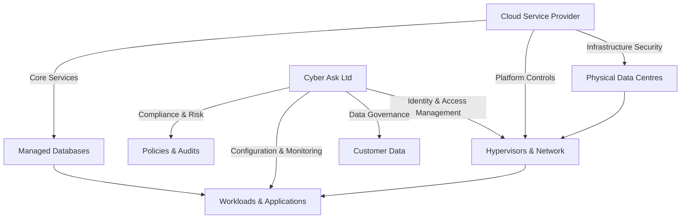

# Cloud Security Policy

**Company:** Cyber Ask Ltd (CYBER ASK LTD), Registered No. 15113248  
**Author:** Wayne Evans (Director)

## Cyber Ask Operating Context

1. Cyber Ask Ltd operates with a single employee who also serves as the sole director responsible for governance, risk, and compliance decisions.
2. Cyber Ask Ltd maintains professional liability insurance covering its consulting and advisory services.
3. A dedicated virtual machine functions as the single Windows Server domain controller and is synchronized with Microsoft Entra ID for identity management.
4. The organisation holds a standard Microsoft 365 licence; Microsoft Purview and Microsoft Defender add-ons are not deployed, and Windows Defender provides endpoint protection.
5. Customer data is stored on BitLocker-encrypted drives to protect information at rest.
6. Cyber Ask Ltd assets are vulnerability-assessed weekly and patched promptly according to remediation guidance.
7. Cyber Ask Ltd has not yet achieved Cyber Essentials, Cyber Essentials Plus, or ISO 27001 certification but aligns its controls with those standards where practicable.
8. The Director personally fulfils HR, IT administration, and compliance duties, engaging specialist suppliers when additional expertise is required.

## Purpose

This policy establishes requirements for cloud security to protect organizational assets and ensure compliance with applicable laws and regulations.

## Scope

This policy applies to all employees, contractors, and third parties who access or manage company resources related to cloud security.

## Policy
1. The organization shall define and document procedures for cloud security.
2. All Microsoft 365 services shall be configured according to Microsoft security and compliance guidance, including Secure Score recommendations.
3. Controls for cloud security must align with industry best practices and regulatory obligations.
4. Activities related to cloud security shall be reviewed and updated regularly to address emerging risks.
5. Records demonstrating compliance with this policy shall be maintained.

1. All aspects of Cloud Security Policy must align with ISO/IEC 27001:2022 controls and the NCSC Cyber Assessment Framework.
2. Procedures shall be documented, communicated, and reviewed at least annually by the Director.
3. Staff and contractors must receive training on Cloud Security Policy before being granted related responsibilities.
4. Access and activities associated with Cloud Security Policy shall be logged and monitored to detect and respond to unauthorised actions.
5. Deviations from this policy must be reported within 24 hours and remedied within 30 days.
6. Technology configurations supporting Cloud Security Policy must follow relevant CIS Benchmarks and vendor hardening guides.
7. Third parties engaged in Cloud Security Policy processes shall have contractual obligations to meet equivalent security standards.
8. Records demonstrating compliance with this policy shall be retained for audit for a minimum of six years.
9. The Director must approve exceptions in writing, including scope, duration, and compensating controls.
10. Failure to comply with this policy may result in disciplinary action, removal of access, or termination of contract.

1. Systems processing Cloud Security Policy shall enforce least privilege and role-based access controls.
2. Changes affecting Cloud Security Policy configurations must follow the Change Management Policy and receive formal approval.
3. Monitoring tools shall generate alerts for Cloud Security Policy violations and designated staff must review these alerts daily.
4. Internal audits shall verify adherence to Cloud Security Policy at least annually and report findings to senior management.
5. Data associated with Cloud Security Policy must be protected in accordance with GDPR and UK statutory requirements.
6. Users shall acknowledge and accept this policy annually to retain relevant access rights.

## Technical Controls

1. Configure and maintain systems to enforce the requirements of the Cloud Security Policy, using appropriate tools and automation.
2. Enable logging, monitoring, and alerting to detect and respond to deviations from the Cloud Security Policy.
3. Apply encryption, access controls, and regular audits to ensure compliance with this policy.
4. Utilize Microsoft Secure Score, Defender for Cloud Apps, and compliance center dashboards to track and remediate security issues.
5. Implement Microsoft 365 Conditional Access, data loss prevention, and retention policies to protect cloud-resident data.

## Roles and Responsibilities

1. **Employees and Contractors:** Follow cloud security procedures and report issues or non-compliance.
2. **Management:** Provide resources and enforce this policy within their areas of responsibility.
3. **Security and Compliance Teams:** Monitor cloud security controls, provide guidance, and coordinate improvements.

## Accountable Roles and Decision Authority

1. **Director:** Owns and maintains this policy, coordinates updates, and ensures alignment with the Cyber Governance Policy and Document Control Policy.
2. **Director (Risk Owner):** Reviews and approves exceptions, risk acceptances, and material control changes, documenting rationale in line with the Risk Management Policy.
3. **Director (Service Owner):** Oversees day-to-day execution of this policy, vendor engagement, and customer communications when actions affect external parties.

## Compliance

Failure to adhere to this policy may result in disciplinary action, up to and including termination, and may expose the organization to legal or regulatory penalties.

## Review

This policy will be reviewed at least annually and updated as necessary to remain effective and compliant with relevant requirements.

## Implementation Guidelines
1. The Director records policy-related approvals and evidence in the central document repository and retains them for audit purposes.
2. BitLocker-encrypted storage protects customer data on company systems, and Windows Defender telemetry is reviewed weekly.
3. Weekly vulnerability scans and monthly patch reviews are led by the Director, with remediation actions tracked to completion.
4. Microsoft 365 security settings rely on features provided within the standard licence; compensating controls are documented when advanced tooling is unavailable.
5. Exceptions require written approval from the Director, including compensating controls and a defined review date.

## Revision History

| Version | Date | Description | Author |
| ------- | ---------- | ----------------------- | ------ |
| 2.0     | 2025-09-10 | Implementation guidelines added | Policy Team |
| 2.1     | 2025-10-05 | Author attribution updated | Wayne Evans (Director) |

## Shared Responsibility Model

Cyber Ask recognises that cloud security is a shared endeavour between the customer and the cloud service provider (CSP). Responsibilities vary by service model (IaaS, PaaS, SaaS) and must be documented for each engagement.

Responsibilities are formalised in supplier contracts, and compliance checks ensure both parties fulfil their obligations.

## Cloud Service Provider Evaluation Checklist

Prior to onboarding a new CSP or renewing an existing contract, the Director must complete the following checklist:

1. **Security Governance**
   - Review independent audit reports (ISO 27001, SOC 2 Type II) and confirm scope covers required services.
   - Evaluate CSP zero-trust posture, including support for conditional access, network segmentation, and logging.
2. **Data Protection**
   - Confirm data residency options and encryption capabilities (at rest and in transit) with customer-managed keys where available.
   - Validate backup and disaster recovery SLAs, ensuring they meet organisational RTO/RPO targets.
3. **Identity and Access**
   - Ensure SSO integration via SAML/OIDC and support for FIDO2 or certificate-based authentication.
   - Assess RBAC granularity and availability of just-in-time privileged access features.
4. **Monitoring and Incident Response**
   - Confirm availability of detailed audit logs, API access for SIEM ingestion, and support for automated alerting.
   - Review CSP incident response commitments, notification timelines, and joint investigation procedures.
5. **Compliance and Legal**
   - Verify contractual clauses covering data processing, subcontractor usage, breach notification, and right-to-audit provisions.
   - Assess alignment with GDPR, UK regulatory requirements, and sector-specific obligations relevant to clients.
6. **Financial and Operational Stability**
   - Evaluate CSP financial health, service uptime history, and roadmap to ensure continuity of operations.
7. **API and Integration Security**
   - Coordinate with the [API Security Policy](./api-security-policy.md) to assess secure API gateway features, rate limiting, and support for mutual TLS.

Findings are documented in the vendor due diligence register, and remediation plans must be agreed upon before contract execution.

## Hybrid Cloud and API Considerations

Many client deliverables rely on integrated cloud and API ecosystems. Cyber Ask maintains tight coupling between this policy and the [API Security Policy](./api-security-policy.md) to manage shared risks:

- Joint architecture reviews validate that API gateways, service meshes, and workload identities enforce zero-trust principles across cloud boundaries.
- Unified logging pipelines collect telemetry from cloud control planes and API platforms to support forensic investigations.
- Change management requires coordinated approvals when modifications impact both cloud infrastructure and exposed APIs.

## Continuous Compliance Monitoring

- Cloud Security Posture Management (CSPM) tools scan environments daily against CIS benchmarks and custom policies. Non-compliant resources trigger automated remediation scripts.
- Secure Score metrics are reviewed weekly, and action plans are tracked to closure within 30 days.
- Quarterly tabletop exercises test cloud incident scenarios, including API abuse and supply chain compromise.

