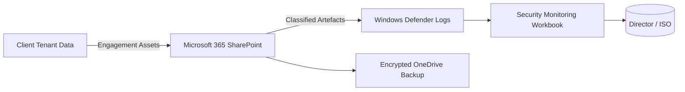

# Information Security Policy

**Company:** Cyber Ask Ltd (CYBER ASK LTD), Registered No. 15113248  
**Author:** Wayne Evans (Director)

This policy defines the organisation's overarching approach to managing information security risks, meeting regulatory commitments, and maintaining compliance with ISO/IEC 27001:2022, the NCSC Cyber Assessment Framework, and applicable data protection legislation.

## Cyber Ask Operating Context

1. Cyber Ask Ltd operates with a single employee who also serves as the sole director responsible for governance, risk, and compliance decisions.
2. Cyber Ask Ltd maintains professional liability insurance covering its consulting and advisory services.
3. A dedicated virtual machine functions as the single Windows Server domain controller and is synchronised with Microsoft Entra ID for identity management.
4. The organisation holds a standard Microsoft 365 licence; Microsoft Purview and Microsoft Defender add-ons are not deployed, and Windows Defender provides endpoint protection.
5. Customer data is stored on BitLocker-encrypted drives to protect information at rest.
6. Cyber Ask Ltd assets are vulnerability-assessed weekly and patched promptly according to remediation guidance.
7. Cyber Ask Ltd has not yet achieved Cyber Essentials, Cyber Essentials Plus, or ISO/IEC 27001 certification but aligns its controls with those standards where practicable.
8. The Director personally fulfils HR, IT administration, and compliance duties, engaging specialist suppliers when additional expertise is required.

## Purpose

Protect the confidentiality, integrity, and availability of information assets by establishing governance, control objectives, and reporting mechanisms that enable continual improvement of the Information Security Management System (ISMS).

## Scope

This policy applies to all employees, contractors, suppliers, and third parties who access or process company information and to all information systems owned, leased, or managed by Cyber Ask Ltd.

## Information Security Objectives

Objectives are set using SMART criteria (Specific, Measurable, Achievable, Relevant, Time-bound) and reviewed quarterly. Progress is tracked in the security metrics pack and escalated via management review meetings.

| Objective | Baseline (FY24) | Target | Measure | Owner | Review Cadence |
| --- | --- | --- | --- | --- | --- |
| Reduce the number of recorded security incidents | 5 incidents | 20% reduction year-on-year | Incident register trend analysis | Director (ISO) | Quarterly |
| Close 95% of risk treatment actions within agreed due dates | 78% | ≥95% by Q4 FY25 | Risk register workflow metrics | Director (Risk Owner) | Monthly |
| Increase completion of annual security awareness training | 60% | 100% by end of Q2 FY25 | LMS completion reports | Director (Service Owner) | Monthly |
| Maintain 100% coverage of critical assets in the asset inventory | 85% | 100% by Q3 FY25 | Asset inventory reconciliation | Director (ISO) | Monthly |
| Achieve compliance with customer contractual data protection clauses | New contracts | 100% adherence by contract go-live | Contract review checklist | Director (Service Owner) | Per engagement |

## Governance Model

1. Senior management endorses the ISMS, allocates resources, and approves objectives, policies, and treatment plans.
2. The Director (ISO) maintains the ISMS, ensures risk management integration, and reports performance metrics to stakeholders.
3. Security objectives are established, measured, and reviewed at least quarterly, with results captured in management review minutes.
4. Policies, procedures, and supporting documents are maintained under version control in the document management repository.

## Organisational Structure for Security

```mermaid
graph TD
    A(Board / Director)
    A --> B(ISMS Manager / Director (ISO))
    B --> C(Security Operations Coordinator)
    B --> D(Risk & Compliance Coordinator)
    B --> E(Business Continuity Lead)
    D --> F(Data Protection Officer (Virtual Advisor))
    E --> G(Incident Response Lead)
    B --> H(Supplier Assurance Lead)
    H --> I(Contracted Specialists)
```

*The organisational chart reflects internal role assignments; some roles (e.g., Data Protection Officer, Supplier Assurance Lead) may be fulfilled by the Director or by contracted specialists as documented in supplier agreements.*

## Regulatory and Framework Alignment

| Obligation | Relevant Requirements | Control Mapping |
| --- | --- | --- |
| UK GDPR / Data Protection Act 2018 | Lawful basis for processing, data subject rights, breach notification (<72 hours) | Data Classification & Handling Policy, Incident Response Plan, Records of Processing Activities |
| NCSC Cyber Assessment Framework | Principles A (Managing security risk), B (Protecting against cyber attack), C (Detecting cyber security events), D (Minimising the impact) | Cyber Governance Policy, Secure Configuration Policy, Security Operations Policy, Business Continuity Management Policy |
| ISO/IEC 27001:2022 | Annex A controls, clause 6.1.3 risk treatment, clause 9.3 management review | Statement of Applicability, Risk Management Policy, Internal Audit Policy |
| Client contractual obligations | Confidentiality, data protection, service level reporting | Supplier Security Policy, Contract Review Checklist, Customer Engagement Runbooks |

## Policy Requirements

1. Maintain an ISMS aligned to ISO/IEC 27001:2022, integrating risk, compliance, and business continuity processes.
2. Inventory and classify information assets, applying handling requirements per the Data Classification and Handling Policy.
3. Authorise and log access to company systems, enforcing least privilege and reviewing privileged accounts quarterly.
4. Enforce multi-factor authentication (MFA) for remote, administrative, and cloud services; disable or change default credentials before deployment.
5. Apply security patches and configuration baselines in accordance with the Patch and Vulnerability Management Policy and relevant CIS Benchmarks; unsupported software must not be used.
6. Enable logging and monitoring on production systems; retain logs for at least 12 months to support forensic investigations.
7. Perform daily encrypted backups of critical information, test restorations quarterly, and document results.
8. Use only company-approved devices and services; personal storage or unauthorised software is prohibited.
9. Report suspected or actual security incidents, weaknesses, or policy breaches immediately via the incident reporting procedure.
10. Maintain records demonstrating compliance with this policy for a minimum of six years.

### Operational Controls

1. Procedures must be documented, communicated, and reviewed annually by the Director.
2. Staff and contractors must receive training before being granted responsibilities associated with this policy.
3. All activities must be logged and monitored to detect unauthorised actions.
4. Deviations must be reported within 24 hours and resolved within 30 days unless formally accepted.
5. Technology configurations must follow relevant hardening guides.
6. Third parties must have contractual obligations to meet equivalent security standards.
7. Exceptions require written approval from the Director, including scope, duration, and compensating controls.

## Risk Management Integration

1. Conduct formal risk assessments using the approved methodology and maintain a master risk register linked to the enterprise GRC platform.
2. Implement controls based on the Statement of Applicability and risk treatment plan, tracking actions through the risk register workflow.
3. Monitor risks continuously and update assessments following significant changes, incidents, or annually at minimum.

## Core Data Flow Diagrams



```mermaid
flowchart LR
    Staff[Director / Staff Device] -->|MFA Auth| Entra[Microsoft Entra ID]
    Entra --> M365[Microsoft 365 Services]
    M365 --> CRM[Client CRM (Encrypted)]
    CRM --> Invoice[Accounting SaaS]
    Invoice --> Bank[Banking Portal]
    Bank --> HMRC[HMRC Submissions]
```

## Statement of Applicability Excerpt

| Control | Applicability | Justification | Implementation Status | Evidence |
| --- | --- | --- | --- | --- |
| A.5.1 Policies for information security | Yes | Foundational governance requirement | Implemented | Approved policy set, management review minutes |
| A.5.7 Threat intelligence | Yes | Required to inform risk treatment decisions | In Progress | Threat bulletin subscriptions, documented review cadence |
| A.5.23 Information security for use of cloud services | Yes | Cloud services host client data | Implemented | Supplier security assessments, Microsoft 365 configuration baseline |
| A.6.3 Information security awareness, education and training | Yes | Mandatory for competency | In Progress | Training content, LMS completion reports |
| A.7.5 Protection against physical and environmental threats | No | Not applicable: no dedicated physical offices or data centres | Not Applicable | Home office risk assessment, supplier hosting attestations |
| A.8.12 Data leakage prevention | Yes | Supports classification handling requirements | Planned | DLP configuration plan, Microsoft Purview business case |

*A comprehensive Statement of Applicability is maintained separately and referenced in Appendix B.*

## Compliance

1. Identify and meet all legal, regulatory, and contractual obligations relevant to information security and data protection.
2. Non-compliance may result in disciplinary action, contractual penalties, or legal consequences.
3. Internal audits verify adherence at least annually, with findings tracked to closure.

## Awareness and Training

1. Provide security awareness training upon onboarding and annually thereafter.
2. Deliver role-specific training for privileged users, incident responders, and supplier managers.
3. Record completion status in the training register and escalate overdue training to the Director.

## Monitoring and Metrics

1. Collect key performance indicators (KPIs) and key risk indicators (KRIs) monthly.
2. Report metrics to management review meetings and the security steering update.
3. Use metrics to inform continual improvement and adjust objectives as required.

## Review and Continual Improvement

1. Review this policy annually or following significant organisational or technological changes.
2. Feed lessons learned from incidents, tests, and audits into the continual improvement log.
3. Track improvement actions in the CAPA register with defined owners and deadlines.

## Appendices

### Appendix A: Policy Cross-References

| Area | Supporting Documents |
| --- | --- |
| Asset Management | Asset Management Policy, Secure Configuration Policy |
| Access Control | Privileged Access Management Policy, Identity and Access Management Standards |
| Incident Response | Incident Response Plan, Corrective and Preventive Action Policy |
| Business Continuity | Business Continuity Management Policy, Scope of ISMS |
| Supplier Assurance | Supplier Security Policy, Supply Chain Continuity Policy |

### Appendix B: Statement of Applicability Reference Documents

1. Full Statement of Applicability (policies/information-security/statement-of-applicability.md).
2. Risk register and treatment plan (Risk Assessments repository).
3. Control testing evidence catalogue (GRC workspace).
4. Internal audit reports and management review records.

## Implementation Guidelines

1. Record policy approvals and evidence in the central document repository and retain for audit purposes.
2. Review Windows Defender telemetry weekly and document findings.
3. Perform weekly vulnerability scans and monthly patch reviews; track remediation actions to completion.
4. Document compensating controls when advanced tooling is unavailable within the Microsoft 365 standard licence.
5. Obtain written approval from the Director for any exceptions, including compensating controls and review dates.

## Revision History

| Version | Date | Description | Author |
| ------- | ---------- | ----------------------- | ------ |
| 3.0     | 2025-10-05 | Comprehensive ISMS refresh, SMART objectives, organisational chart, regulatory mapping, data flow diagrams, and SoA excerpt added | Wayne Evans (Director) |
| 2.1     | 2025-10-05 | Author attribution updated | Wayne Evans (Director) |
| 2.0     | 2025-09-10 | Implementation guidelines added | Policy Team |
