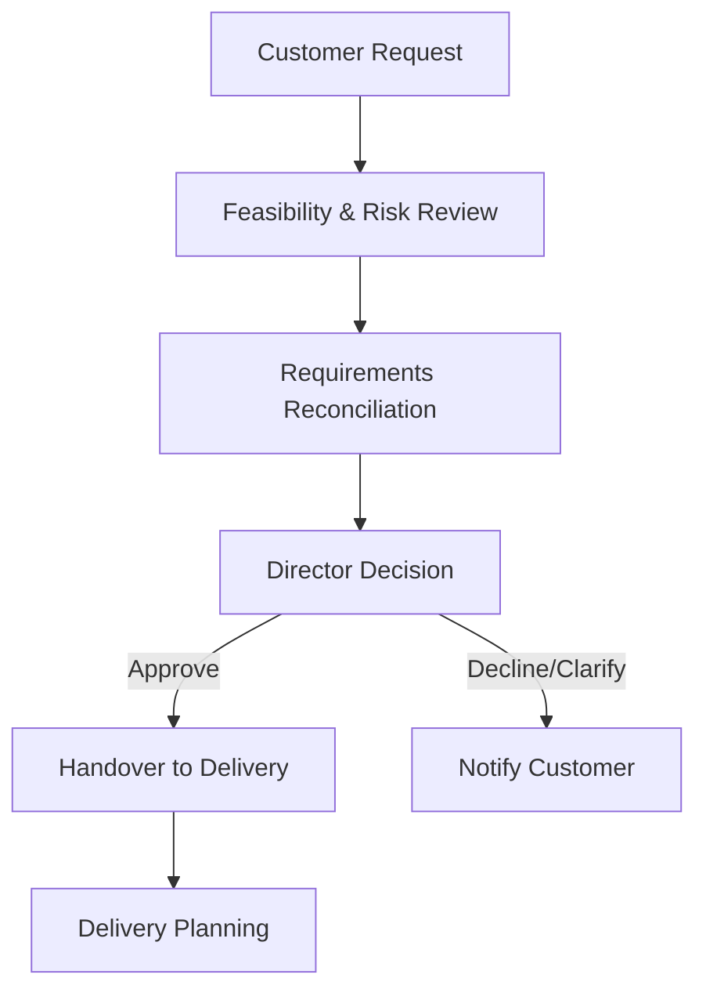

# Contract and Order Review Procedure

## Purpose
Define a controlled approach for reviewing customer enquiries, proposals, and purchase orders to ensure Cyber Ask Ltd can meet specified requirements before commitment.

## Scope
Applies to all customer contracts, statements of work, purchase orders, and significant change requests, including subcontracted deliverables.

## Roles and Responsibilities
- **Director:** Owns this procedure, performs reviews, approves acceptance or rejection, and documents outcomes.
- **Specialist Suppliers (when engaged):** Provide technical or commercial input to feasibility assessments and confirm their own capacity.

## Inputs
- Customer requests for proposal or quote
- Draft contracts or terms
- Statements of work or specifications
- Applicable standards, legal, or regulatory obligations

## Procedure
1. **Intake and Logging**
   - Register the request using the *Customer Requirements Review* template and assign a unique identifier linked to the contract or opportunity.
   - Identify deadlines, deliverables, confidentiality constraints, security or quality requirements, and data protection considerations.
2. **Feasibility and Risk Review**
   - Confirm scope clarity, acceptance criteria, dependencies, and assumptions; document queries to the customer.
   - Assess capability, capacity, and resource availability; involve suppliers where relevant and verify they meet onboarding requirements.
   - Evaluate commercial risks, data protection obligations, export controls, conflict-of-interest concerns, and alignment with risk appetite.
3. **Requirements Reconciliation**
   - Map customer requirements to Cyber Ask deliverables; highlight gaps, exclusions, or assumptions and propose mitigations.
   - Verify alignment with the Quality Policy, quality objectives, relevant security policies, and applicable regulatory or contractual clauses.
4. **Approval and Communication**
   - Document review results, decision (proceed/decline/seek clarification), and conditions including any dependencies on customer actions.
   - Obtain Director approval before issuing proposals, accepting purchase orders, or signing contracts. Record approvals in the review form.
   - Communicate clarifications or deviations to the customer and record acknowledgements in the controlled repository.
5. **Post-Acceptance Handover**
   - Transfer approved requirements, risks, and commitments to delivery owners, providing links to relevant templates (e.g., *Production and Service Checklist*, *Service Delivery Record*).
   - File the signed contract, proposal, and review record in the controlled document repository; update the Policy Index if new deliverable templates are created.

### Contract and Order Review Flow

## Records and Retention
- Completed *Customer Requirements Review* forms, correspondence, and approval evidence are retained for at least six years or the duration of the contract plus one year, whichever is longer.
- Records are stored in the controlled QMS repository with version control per the Document Control Policy.

## Monitoring and Measurement
- Track review cycle times, win/loss outcomes, and defects traced to requirement gaps.
- Review metrics during management reviews to drive continual improvement.

## Related Documents and Templates
- Quality Policy
- Quality Manual and Process Map
- *Customer Requirements Review* template (templates/quality/customer-requirements-review.md)
- Document Control Policy
