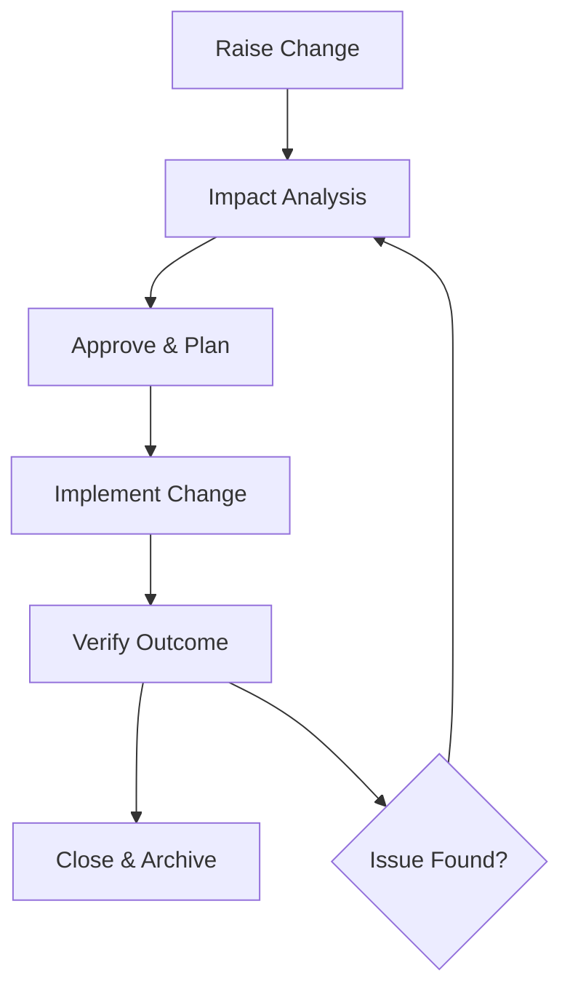

# Control of Changes Procedure

## Purpose
Provide a structured approach to identifying, approving, implementing, and recording changes that affect quality, service delivery, or contractual commitments.

## Scope
Applies to changes in requirements, design outputs, processes, tooling, suppliers, and controlled documents that impact customer deliverables or the QMS.

## Roles and Responsibilities
- **Director:** Reviews and approves change requests, assigns owners, and ensures records are maintained.
- **Change Owner (Director or delegate):** Assesses impact, plans implementation, and communicates outcomes.

## Inputs
- Change requests from customers, audits, incidents, or continual improvement actions
- Impact assessments covering quality, cost, schedule, security, and compliance

## Procedure
1. **Initiation**
   - Log the change request with a unique identifier, source, and description. Identify whether the change is corrective, preventive, or improvement driven.
   - Determine whether immediate containment is required and whether a Nonconformity record must be opened.
2. **Impact Analysis**
   - Assess effects on requirements, design, production/service steps, suppliers, risks, and records. Confirm affected templates and policies in the Policy Index.
   - Consult affected stakeholders and suppliers as needed. Update risk assessments where the change alters threat exposure.
3. **Approval**
   - Define implementation steps, resources, and rollback plans. Identify required training or communication.
   - Obtain Director approval prior to implementation; record approvals in the change log along with planned start and completion dates.
4. **Implementation**
   - Execute approved actions, updating controlled documents, checklists, and training materials. Ensure superseded versions are archived per the Document Control Policy.
   - Communicate changes to impacted personnel and customers when required; record acknowledgements.
5. **Verification and Closure**
   - Verify the change achieved intended outcomes without introducing new issues. Validate that related templates and procedures reference the updated process.
   - Update related records, including design, production, service delivery documents, and the Policy Index where relevant.
   - Close the change with evidence, date, and approver signature. If acceptance criteria are not met, reopen or raise a new change record.

### Change Control Flow

## Records and Retention
- Change logs, approvals, updated documents, and verification evidence are retained for at least six years or for the life of the service plus one year.
- Records are maintained under document control with version history and access controls.

## Monitoring and Measurement
- Track change cycle times, rollback occurrences, and post-change issues.
- Review significant changes and trends during management reviews for continual improvement.

## Related Documents and Templates
- Document Control Policy
- Design and Development Control Procedure
- Production and Service Provision Procedure
- Management Review Procedure
