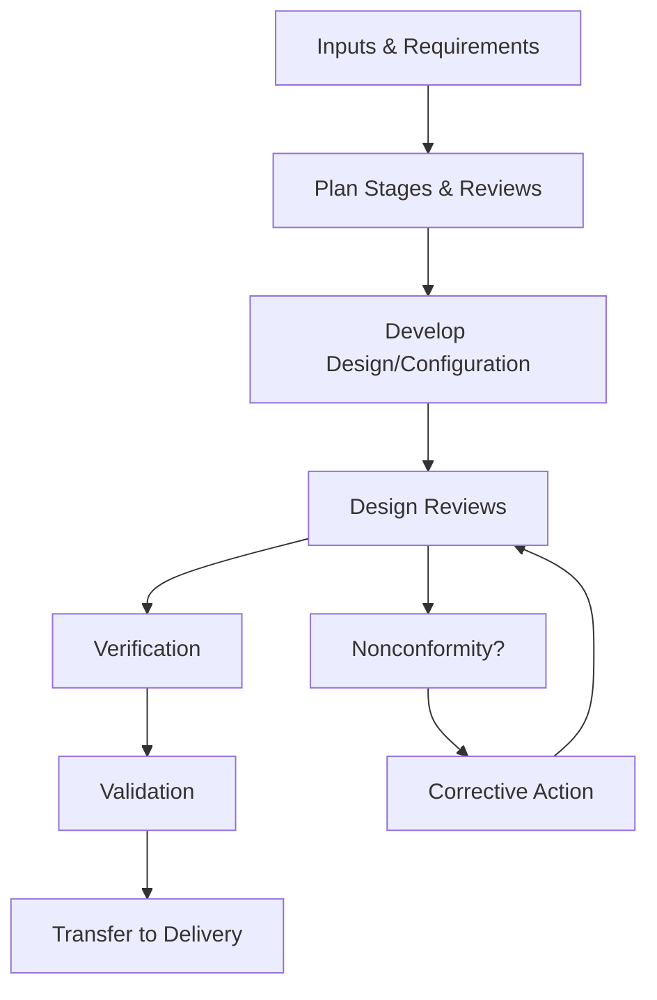

# Design and Development Control Procedure

## Purpose
Establish disciplined controls for designing and developing services, solutions, or deliverables, including verification and validation to ensure outputs meet specified requirements.

## Scope
Applies to new or significantly changed services, methodologies, tools, and customer-specific deliverables where Cyber Ask Ltd defines or configures solution designs.

## Roles and Responsibilities
- **Director:** Approves design plans, conducts reviews, and authorises release of design outputs.
- **Technical Lead or Supplier (as appointed):** Produces design artefacts, executes verification and validation activities, and records results.
- **Quality Representative (Director role in single-person context):** Ensures records completeness and alignment with the Quality Manual and objectives.

## Inputs
- Approved customer requirements and acceptance criteria
- Applicable standards, regulatory requirements, and security or privacy controls
- Risk assessments and previous lessons learned

## Procedure
1. **Planning**
   - Define design and development stages, responsibilities, interfaces, and review points using the *Design Review, Verification, and Validation Record* template.
   - Identify required competencies, tools, and supplier involvement. Capture planned checkpoints for security, privacy, and quality objectives.
2. **Design Inputs**
   - Capture functional and non-functional requirements, regulatory constraints, and interface definitions.
   - Document assumptions, dependencies, and acceptance criteria. Validate completeness with the *Customer Requirements Review* where applicable.
3. **Design and Development Activities**
   - Develop architectures, specifications, configurations, and work instructions proportionate to complexity.
   - Maintain traceability between inputs, risks, and outputs, referencing risk treatment plans and any change requests.
4. **Design Reviews**
   - Conduct stage-gate reviews to confirm adequacy, feasibility, and risk mitigations.
   - Record attendees, decisions, actions, and approvals in the template. Update the Policy Index if new work instructions are created.
5. **Verification**
   - Confirm outputs meet inputs through inspection, walkthroughs, calculations, or test execution.
   - Log results, defects, and rework, ensuring corrective actions are captured. Initiate the Nonconformity and Corrective Action Procedure for significant deviations.
6. **Validation**
   - Demonstrate the service or deliverable meets intended use and customer expectations through pilots, user acceptance tests, or demonstrations.
   - Capture evidence, deviations, and approvals prior to release, linking records to the contract or project identifier.
7. **Transfer and Release**
   - Package approved outputs (design packs, configurations, instructions) and communicate to delivery teams. Confirm required templates and checklists are available for production/service execution.
   - Obtain Director approval before release to production or customer delivery. Archive design artefacts and review minutes in the controlled repository.

### Design and Development Flow

## Records and Retention
- Design plans, review minutes, verification/validation evidence, and approvals are retained for at least six years after delivery or for the life of the service plus one year.
- Records are version-controlled and stored per the Document Control Policy and quality record retention requirements.

## Monitoring and Measurement
- Track defect density, rework effort, and on-time completion of design stages.
- Review metrics and lessons learned in management reviews and apply to future projects.

## Related Documents and Templates
- Quality Manual and Quality Objectives
- Risk Assessment Template and Security Requirements
- *Design Review, Verification, and Validation Record* (templates/quality/design-review-verification-validation.md)
- Document Control Policy
