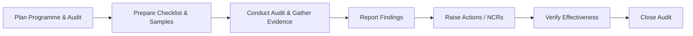

# Internal Audit Procedure

## Purpose
Establish a systematic approach for planning, conducting, and reporting internal audits to verify the Quality Management System conforms to planned arrangements and ISO 9001 clause 9 requirements and to drive corrective and preventive improvements.

## Scope
Covers all QMS processes, including outsourced processes and supplier controls. Applies to planned audits and additional audits triggered by significant changes, nonconformities, customer complaints, or management review requests.

## Roles and Responsibilities
- **Director:** Approves the audit programme, selects auditors, ensures auditor independence from the activity audited, and reviews audit results and corrective actions.
- **Auditor (Director or competent delegate):** Plans and performs audits objectively, records evidence, issues findings, and raises nonconformities using the *Nonconforming Output Report* when required.
- **Audited Process Owner:** Provides access to records, clarifies process execution, and implements corrective actions.

## Inputs
- Previous audit results and open actions
- Process performance data, complaints, nonconformities, and risk assessments
- Changes to processes, tools, or suppliers

## Procedure
1. **Audit Planning**
   - Prepare an annual audit programme covering all QMS processes; adjust frequency based on risk, recent changes, and customer or regulatory focus areas.
   - Define audit scope, criteria, methods, and sampling using the *Audit Plan* template. Plan sampling to include at least one record per controlled template relevant to the process.
2. **Audit Preparation**
   - Review relevant procedures, records, previous findings, and applicable policies listed in the Policy Index.
   - Develop checklists or questions tailored to the process under review; confirm availability of required evidence before the audit date.
3. **Audit Execution**
   - Conduct interviews, observe activities, and sample records to assess conformity and effectiveness. Capture objective evidence (file names, dates, identifiers) in notes.
   - Immediately communicate significant issues that require containment so the Nonconformity and Corrective Action Procedure can be initiated.
4. **Reporting**
   - Classify findings (conformity, observation, nonconformity) and complete the *Audit Report* template, cross-referencing the *Nonconforming Output Report* ID if raised.
   - Communicate results to the Director and affected process owners, agreeing owners and due dates for each action.
5. **Follow-up**
   - Track corrective actions through the Nonconformity and Corrective Action Procedure, using the *Corrective Action Plan* and *Effectiveness Check* templates.
   - Verify implementation and effectiveness; close findings when evidence supports conformity. Re-sample records if necessary to demonstrate sustained control.

### Internal Audit Flow

## Records and Retention
- Audit plans, reports, evidence, and follow-up records are retained for at least six years.
- Records are controlled under the Document Control Policy with version history and access controls.

## Monitoring and Measurement
- Monitor completion of planned audits versus schedule and timely closure of audit actions.
- Review audit trends and recurring themes in management reviews.

## Related Documents and Templates
- *Audit Plan* (templates/quality/audit-plan.md)
- *Audit Report* (templates/quality/audit-report.md)
- *Nonconforming Output Report* (templates/quality/nonconforming-output-report.md)
- *Corrective Action Plan* (templates/quality/corrective-action-plan.md)
- Management Review Procedure
- Document Control Policy
