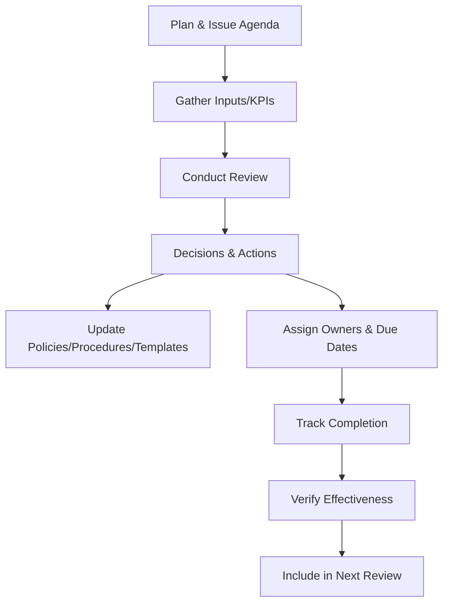

# Management Review Procedure

## Purpose
Ensure top management reviews the Quality Management System (QMS) at planned intervals to confirm suitability, adequacy, effectiveness, and alignment with strategic direction, and to ensure outputs feed updates to policies, procedures, objectives, and templates.

## Scope
Applies to at least annual management reviews covering ISO 9001 clause 9.3 topics and actions. Interim reviews may be convened after significant events (major incidents, material customer feedback, or significant organisational changes).

## Roles and Responsibilities
- **Director:** Chairs the review, sets the agenda, ensures inputs are available, and approves actions.
- **Process Owners (Director or delegate):** Provide performance data, risks, opportunities, and action updates.

## Inputs
- Status of previous management review actions
- Internal and external audit results
- Customer feedback, complaints, and satisfaction data
- Process performance, quality objectives, and KPI results
- Nonconformities, corrective actions, and effectiveness results
- Changes in context, risks, opportunities, and resource needs
- Adequacy of supplier performance and external provider controls

## Procedure
1. **Planning**
   - Schedule the review at least annually; publish agenda and required inputs using the *Management Review Minutes* template and circulate at least two weeks in advance.
   - Confirm attendees, roles, and any remote participation arrangements. Assign a scribe (Director role in a single-person context) to capture decisions and evidence.
2. **Conducting the Review**
   - Review each required input, capturing discussion points, decisions, and assigned actions. Validate that controlled templates remain fit-for-purpose and update the Policy Index if new documents are added.
   - Evaluate QMS performance, adequacy of resources, effectiveness of actions to address risks and opportunities, and potential changes needed. Include an explicit review of customer complaints, audit findings, supplier performance, and technology/tooling adequacy.
3. **Outputs**
   - Document conclusions on QMS suitability and improvement opportunities; ensure outputs reference the relevant procedure or template to update.
   - Record decisions and actions related to process improvements, resource allocation, competence needs, changes to the QMS, and external provider performance. Assign due dates and responsible owners for each action.
4. **Follow-up**
   - Track action owners, due dates, and evidence of completion. Actions that involve new or updated templates should be logged in the controlled repository with version history.
   - Review action status in subsequent management meetings and internal audits; escalate overdue items during governance catch-ups.

### Management Review Flow

## Records and Retention
- Management review minutes, action logs, and supporting data are retained for at least six years.
- Records are maintained under document control with traceable version history.

## Monitoring and Measurement
- Verify timely closure of management review actions.
- Compare KPI trends year over year to evaluate continual improvement.

## Related Documents and Templates
- *Management Review Minutes* (templates/quality/management-review-minutes.md)
- Quality Objectives and Plan
- Internal Audit Procedure
- Nonconformity and Corrective Action Procedure
- Document Control Policy
