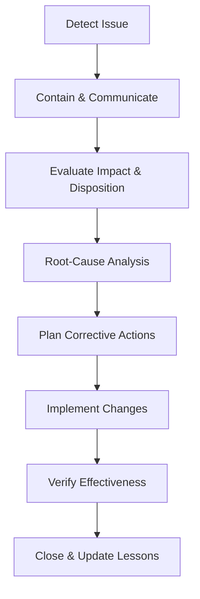

# Nonconformity and Corrective Action Procedure

## Purpose
Define how Cyber Ask Ltd identifies, controls, and corrects nonconforming outputs and implements corrective actions to prevent recurrence.

## Scope
Covers nonconformities in deliverables, processes, supplier outputs, audits, and management system deviations.

## Roles and Responsibilities
- **Director:** Owns the procedure, approves containment and corrective actions, and verifies effectiveness.
- **Process Owner (Director or delegate):** Records nonconformities, performs root-cause analysis, and implements actions.

## Inputs
- Nonconforming output reports
- Audit findings, customer feedback, incidents, and monitoring data
- Risk assessments and previous corrective actions

## Procedure
1. **Detection and Containment**
   - Record the issue in a *Nonconforming Output Report* and determine scope and immediate risks.
   - Segregate, rework, or stop affected work to prevent unintended delivery. If customer deliverables are impacted, inform the customer and agree temporary controls.
2. **Evaluation and Disposition**
   - Assess impact on requirements, customers, regulatory obligations, suppliers, and information security controls.
   - Decide disposition: rework, repair, use-as-is (with approval), or scrap/withdraw. Document rationale and approvals in the report.
3. **Root-Cause Analysis**
   - Analyse contributing factors using the *Root-Cause Analysis Worksheet*; consider people, process, technology, environment, supplier performance, and control breakdowns.
   - Identify whether existing procedures, templates, or training require updates.
4. **Corrective Action Planning**
   - Define actions, owners, due dates, and verification steps using the *Corrective Action Plan* template. Include updates to templates, checklists, or training where applicable.
   - Obtain Director approval for plans before implementation; record any required change controls.
5. **Implementation and Verification**
   - Execute actions, update affected documents or controls, and communicate changes to stakeholders and suppliers.
   - Verify effectiveness using the *Effectiveness Check* template; escalate if issues persist. Confirm that similar records sampled after implementation show sustained conformity.
6. **Closure and Learning**
   - Close records when evidence shows the nonconformity is resolved and effectiveness is confirmed. Link closure evidence to contract or project IDs.
   - Capture lessons learned and feed into risk assessments, training, and management reviews. Update the Policy Index and affected procedures if systemic changes are required.

### Nonconformity Handling Flow

## Records and Retention
- Nonconformity reports, root-cause analyses, corrective action plans, and effectiveness checks are retained for at least six years after closure.
- Records are controlled and versioned in accordance with the Document Control Policy.

## Monitoring and Measurement
- Track number and severity of nonconformities, recurrence rates, and action completion timeliness.
- Monitor time-to-containment for high-severity issues and measure repeat findings during internal audits.
- Review trends during management reviews and internal audits.

## Related Documents and Templates
- *Nonconforming Output Report* (templates/quality/nonconforming-output-report.md)
- *Root-Cause Analysis Worksheet* (templates/quality/root-cause-analysis.md)
- *Corrective Action Plan* (templates/quality/corrective-action-plan.md)
- *Effectiveness Check* (templates/quality/effectiveness-check.md)
- Internal Audit Procedure
- Management Review Procedure
