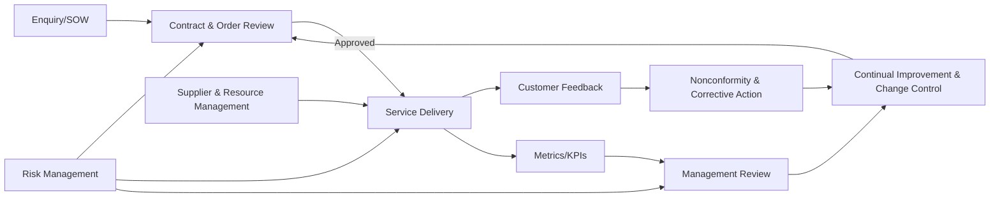

# Process Map

This process map aligns with the Quality Manual and highlights where controlled templates are used. Each process owner maintains records in the controlled repository to evidence conformity and traceability.

## Core Processes
- **Opportunity and Proposal Management**
  - Inputs: customer enquiry, statement of work requirements, risk assessment triggers, and applicable clauses from the Quality Policy.
  - Outputs: proposals, estimates, contracts, agreed acceptance criteria, and the completed *Customer Requirements Review* form.
  - Interfaces: feeds Service Delivery; receives risk insights from Risk Management and lessons learned from Continual Improvement; invokes Change Control when scope alters.
- **Service Delivery and Project Execution**
  - Inputs: approved contracts, scope and requirements, project plan, documented controls, and the *Production and Service Checklist*.
  - Outputs: deliverables, status reports, change requests, acceptance records, and the *Service Delivery Record* with evidence.
  - Interfaces: consumes Document Control assets; provides performance data to Management Review and Customer Feedback; triggers Nonconformity and Corrective Action when defects occur.
- **Customer Feedback and Issue Management**
  - Inputs: satisfaction surveys, complaints, ad-hoc feedback, monitoring alerts, and outputs from service acceptance meetings.
  - Outputs: corrective actions, improvement opportunities, updates to knowledge base, and *Nonconforming Output Reports* when needed.
  - Interfaces: supplies data to Continual Improvement and Management Review; informs Risk Management where issues introduce new risks or require escalation to customers.

## Support Processes
- **Risk Management**
  - Inputs: project risks, supplier risks, security findings, change requests, and customer escalations.
  - Outputs: risk register entries, treatment plans, residual risk approvals, and updates to project plans.
  - Interfaces: informs Opportunity Management, Service Delivery, and Management Review; receives incident information from Customer Feedback and Internal Audit.
- **Document Control**
  - Inputs: policy updates, templates, records from delivery activities, and actions from audits or management review.
  - Outputs: version-controlled documents, published templates, archived records, and evidence logs linked to contract identifiers.
  - Interfaces: supports all core processes; receives improvement actions from Continual Improvement and Change Control.
- **Supplier and Resource Management**
  - Inputs: competency requirements, supplier evaluations, contract terms, onboarding forms, and calibration needs.
  - Outputs: approved supplier list, onboarding records, performance reviews, and calibrated equipment records using the *Equipment Calibration Log*.
  - Interfaces: provides qualified resources to Service Delivery and receives feedback from Customer Feedback and Management Review.
- **Management Review and Continual Improvement**
  - Inputs: KPI dashboards, audit findings, feedback, nonconformities, risk status, resource updates, and status of objectives.
  - Outputs: decisions, action plans, updated objectives, policy changes, and communication of priorities to process owners.
  - Interfaces: drives updates to all processes; monitors the effectiveness of actions and closes items once verified through the *Effectiveness Check* template.

## Interaction Overview
- Opportunities flow into Service Delivery once accepted; Document Control provides the standard artefacts to start work.
- Service Delivery produces outputs that feed Customer Feedback and KPI tracking; nonconformities trigger Risk Management and improvement actions.
- Management Review consolidates metrics and feedback, directing changes to objectives, processes, and documented policies.
- Supplier and Resource Management supports both Opportunity Management and Service Delivery, ensuring capability and availability.

### High-Level Flow

