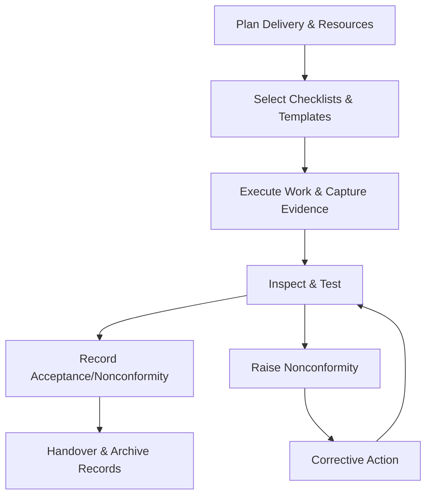

# Production and Service Provision Procedure

## Purpose
Provide controlled steps for delivering services or products to ensure conformity with requirements, including equipment management and service delivery checks.

## Scope
Applies to all delivery activities for consulting engagements, managed services, and any products produced or configured by Cyber Ask Ltd or its suppliers.

## Roles and Responsibilities
- **Director:** Approves delivery plans, oversees service execution, and ensures competent resources are assigned.
- **Delivery Lead (Director or appointed resource):** Executes tasks, maintains records, and coordinates suppliers.

## Inputs
- Approved contracts, requirements, and design outputs
- Production or service checklists and work instructions
- Calibrated equipment or validated tools where applicable

## Procedure
1. **Preparation**
   - Confirm prerequisites: approved requirements, design outputs, acceptance criteria, and risk treatment plans.
   - Assign responsibilities and schedule milestones; verify supplier readiness where relevant. Identify required templates (e.g., *Service Delivery Record*, *Production and Service Checklist*).
2. **Control of Work Instructions**
   - Use standard operating procedures or production/service checklists appropriate to the engagement.
   - Ensure controlled documents are current and accessible to delivery personnel. Record any approved deviations on the checklist with Director approval.
3. **Equipment and Tooling Control**
   - Verify tools and equipment are calibrated or validated; record status using the *Equipment Calibration Log*.
   - Remove or tag out-of-calibration equipment and escalate for recalibration or replacement. Document impact assessment on any work already performed.
4. **Service Delivery and Production Execution**
   - Perform tasks per checklist, noting deviations, risks, and approvals. Capture communication with customers on significant decisions or changes.
   - Capture objective evidence (artifacts, screenshots, logs) supporting conformity to requirements. Link evidence to contract, project, or ticket identifiers.
5. **Inspection and Acceptance**
   - Conduct in-process and final checks against acceptance criteria using the *Production and Service Checklist* and *Service Delivery Record* as applicable.
   - Record defects as nonconformities and initiate corrective actions when required. Confirm actions do not invalidate prior test results.
6. **Handover and Release**
   - Obtain customer acceptance or internal approval before release; document approvals in the *Service Delivery Record*.
   - File delivery records, approvals, and evidence in the QMS repository and update the Policy Index if new templates were created.

### Production and Service Flow

## Records and Retention
- Completed production/service checklists, calibration records, acceptance evidence, and nonconformity reports are retained for at least six years after delivery or contract completion, whichever is longer.
- Records follow document control requirements for access, versioning, and retention.

## Monitoring and Measurement
- Track on-time delivery, rework, customer feedback, and service-level performance.
- Review metrics and recurring issues during management reviews to inform improvement actions.

## Related Documents and Templates
- *Production and Service Checklist* (templates/quality/production-and-service-checklist.md)
- *Equipment Calibration Log* (templates/quality/equipment-calibration-log.md)
- *Service Delivery Record* (templates/quality/service-delivery-record.md)
- Nonconformity and Corrective Action Procedure
- Document Control Policy
