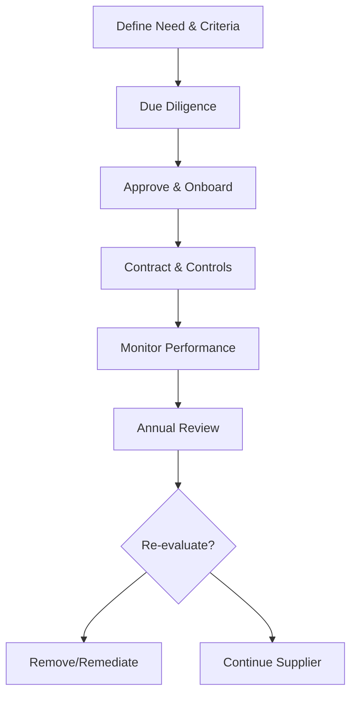

# Purchasing and Supplier Evaluation Procedure

## Purpose
Define controls for selecting, approving, and monitoring suppliers to ensure purchased products and services meet Cyber Ask Ltd requirements and customer commitments.

## Scope
Applies to all suppliers providing products, services, subcontracted work, tooling, or cloud services that affect service quality, security, or compliance.

## Roles and Responsibilities
- **Director:** Approves supplier selection, manages contracts, and maintains the approved supplier list.
- **Supplier Owner (Director or delegate):** Performs due diligence, monitors performance, and escalates issues.

## Inputs
- Business or project requirements
- Supplier proposals, certifications, and references
- Risk assessments and information security requirements

## Procedure
1. **Qualification and Due Diligence**
   - Define required capabilities, regulatory constraints, and quality or security criteria, referencing applicable policies in the Policy Index.
   - Assess supplier competence, capacity, financial stability, and relevant certifications. Confirm subcontractors used by the supplier meet the same expectations.
   - Document results in the approved supplier record and retain evidence such as certificates, references, and security questionnaires.
2. **Selection and Approval**
   - Compare shortlisted suppliers against defined criteria, risk appetite, and results of due diligence.
   - Obtain Director approval prior to onboarding or contract award. Record approved scope, limitations, and review frequency in the supplier register.
3. **Contracting and Controls**
   - Ensure contracts include scope, deliverables, service levels, confidentiality, data protection, change control, right-to-audit clauses, and requirements to use controlled templates where applicable.
   - Establish acceptance criteria and quality checkpoints for purchased products or services. Link checkpoints to the *Production and Service Checklist* if the supplier supports delivery.
4. **Performance Monitoring**
   - Track delivery performance, issues, and corrective actions; log nonconformities when outputs deviate using the *Nonconforming Output Report*.
   - Review supplier performance at least annually and during management reviews. Update risk ratings and corrective action status.
5. **Re-evaluation and Removal**
   - Re-evaluate suppliers after significant incidents, recurring issues, or at planned intervals. Consider the need for re-onboarding after long inactivity.
   - Remove or suspend suppliers who fail to meet requirements and document decisions. Communicate outcomes to delivery teams and update the supplier list.

### Supplier Management Flow

## Records and Retention
- Approved supplier evaluations, contracts, performance reviews, and corrective actions are retained for at least six years or the contractual retention requirement, whichever is longer.
- Records are stored under document control with versioning and access restrictions.

## Monitoring and Measurement
- Monitor on-time delivery, quality of supplied outputs, responsiveness, and issue recurrence.
- Track supplier risk ratings and mitigation actions.

## Related Documents and Templates
- Document Control Policy
- *Nonconforming Output Report* template (templates/quality/nonconforming-output-report.md)
- *Corrective Action Plan* template (templates/quality/corrective-action-plan.md)
- Quality Manual and Process Map
