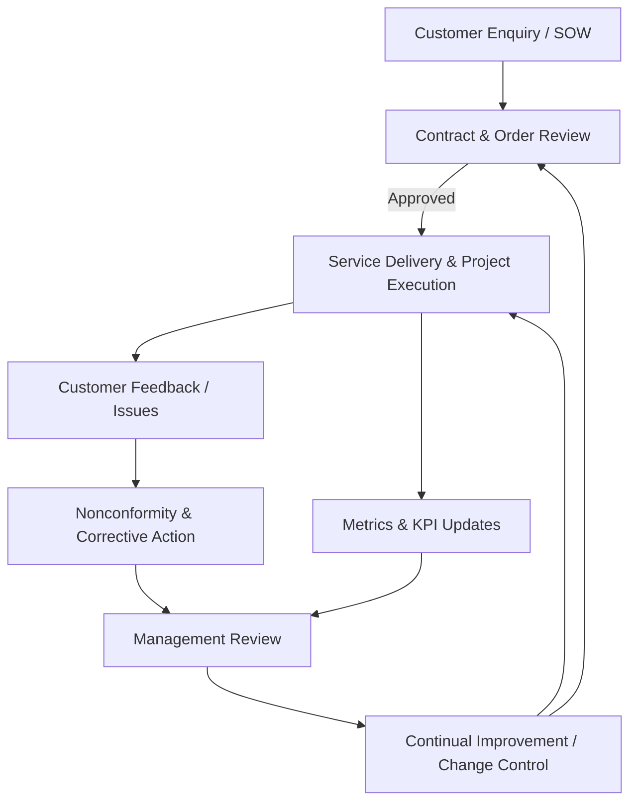

# Quality Manual

## Scope
- Quality Management System (QMS) covering consulting and advisory services delivered by Cyber Ask Ltd, including service design, delivery, managed-service handover, and continual improvement activities.
- Applicable to all personnel, contractors, and suppliers who contribute to service delivery, data handling, or customer experience, regardless of engagement length or delivery channel.
- Excludes services delivered entirely by third parties where Cyber Ask Ltd has no operational control, though due diligence, onboarding checks, and oversight of externally provided processes remain in scope.

## Organizational Context
- A lean operating model with one Director who fulfils governance, risk management, HR, and IT administration duties and appoints deputies when unavailable.
- Reliance on Microsoft 365 services and a single Windows Server domain controller synchronized with Microsoft Entra ID. Core records are retained in the controlled SharePoint document library per the Document Control Policy.
- Customer engagements vary from short advisory tasks to recurring managed services, with deliverables governed by contract-specific statements of work and tracked through controlled templates.
- Risk posture aligns with ISO 9001 principles and integrates with information security controls derived from ISO/IEC 27001, Cyber Essentials, and data protection requirements where applicable.

## Interested Parties and Needs
- **Customers:** Reliable delivery, accurate advice, timely reporting, responsiveness to feedback, protection of confidential information, and verified competence of personnel.
- **Regulators and Legal Authorities:** Compliance with UK legislation, data protection requirements, and contractual obligations, including defence-sector conditions where relevant.
- **Suppliers and Partners:** Clear requirements, timely payment, defined responsibilities when supporting delivery, and onboarding checks that explain quality expectations.
- **Internal Roles:** Director and any contracted specialists require defined processes, authority, competence requirements, and criteria for accepting or rejecting work products.

## Process Interactions and Interfaces
- Proposal and contract management provide inputs (requirements, scope, acceptance criteria) to service delivery and project execution using the *Customer Requirements Review* template.
- Service delivery produces customer outcomes and evidence for performance reporting, feeding metrics to management review and quality objectives.
- Risk management informs project planning, change control, and improvement actions; outputs include treatment plans and updates to controls that are referenced in delivery checklists.
- Customer feedback and issue management capture inputs that drive corrective actions, knowledge updates, and service improvements logged through the *Nonconforming Output Report* and *Corrective Action Plan* templates.
- Document control maintains controlled templates and records, ensuring versioned outputs for audits and customer assurance. Controlled templates reside in `templates/quality` and are referenced by each procedure.

### Process Interaction Flow (overview)

## Roles, Responsibilities, and Authority
- **Director:** Owns the QMS, approves policies, sets quality objectives, allocates resources, and has authority to stop or change work that jeopardises quality or compliance. The Director approves deviations to processes and waivers to acceptance criteria.
- **Project/Service Leads (may be fulfilled by the Director):** Plan and deliver engagements, ensure adherence to procedures and checklists, collect and store records, and maintain clear communication with customers.
- **Specialist Contractors:** Execute assigned tasks according to documented procedures, complete assigned records (e.g., service delivery, calibration logs), and report nonconformities or risks promptly.
- **All Personnel:** Follow applicable policies, contribute to continual improvement by raising issues or opportunities, and participate in reviews as requested.

## Documented Information and Control
- Controlled policies, procedures, and templates are stored in the version-controlled repository; superseded versions are archived with change history per the Document Control Policy.
- Records include signed contracts, delivery checklists, service reports, audit evidence, and corrective action logs. Each procedure references the required template and minimum retention period.
- Quality records may be electronic or paper; scanned copies are uploaded to the controlled location with unique identifiers and cross-references to contracts or projects.

## Continual Improvement and Review
- Management review occurs at least annually or after significant events to assess performance, nonconformities, audit findings, and customer feedback, using the *Management Review Minutes* template to capture evidence and actions.
- Improvement actions are documented with owners, due dates, and verification of effectiveness before closure, using the *Corrective Action Plan* and *Effectiveness Check* templates. Action status is reviewed during internal audits and monthly governance catch-ups.

## Key Performance Indicators
- On-time delivery percentage against agreed milestones.
- Number of defects or customer complaints per project, and time-to-containment for nonconformities.
- Completion rate of planned internal audits and management reviews.
- Timeliness of corrective action closure and effectiveness verification.

## Related Policies, Procedures, and Templates
- Quality Policy (policies/quality-policy.md).
- Policy Index (policies/policy-index.md) for cross-referenced security, legal, and quality governance.
- All QMS procedures in `qms/` and controlled templates in `templates/quality/` linked within each procedure.
